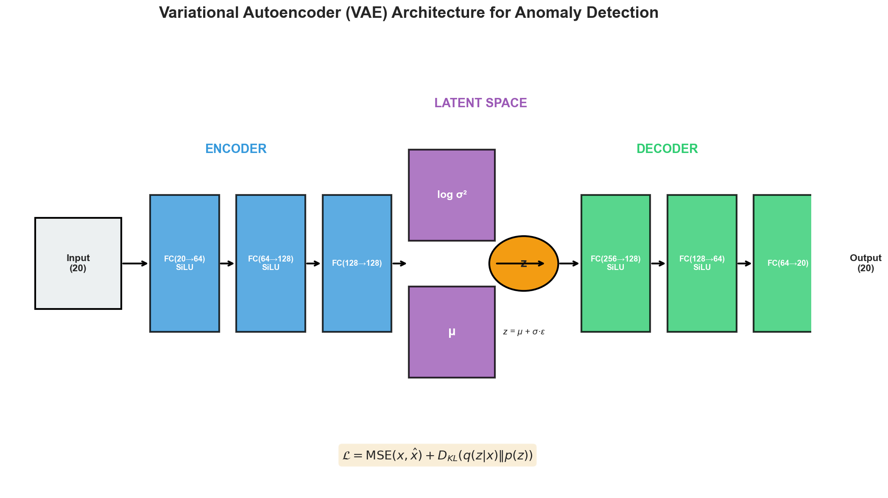
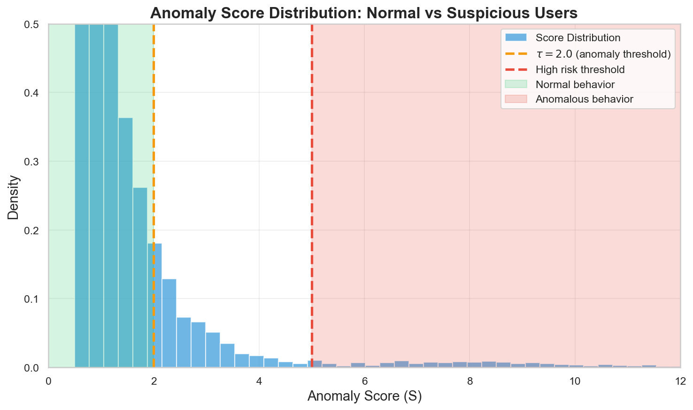
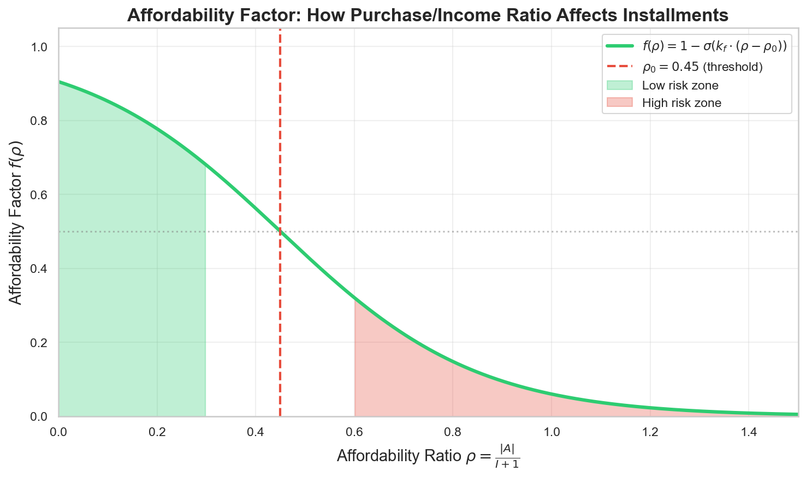
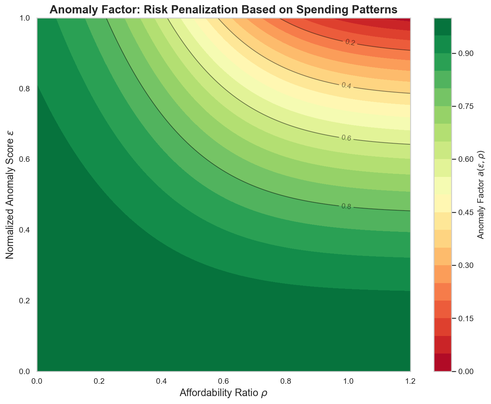
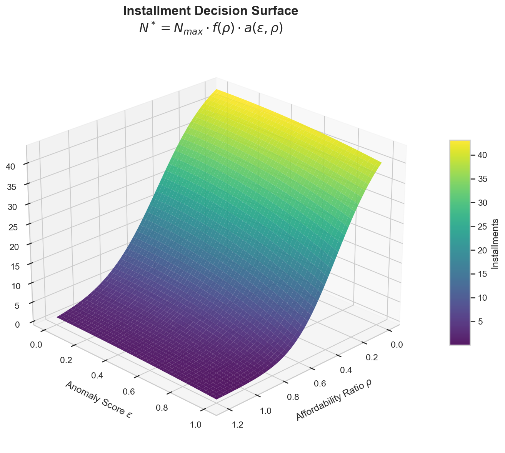
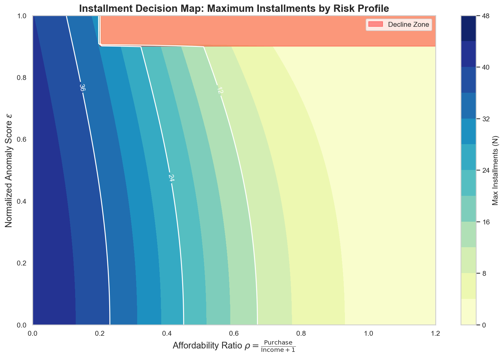
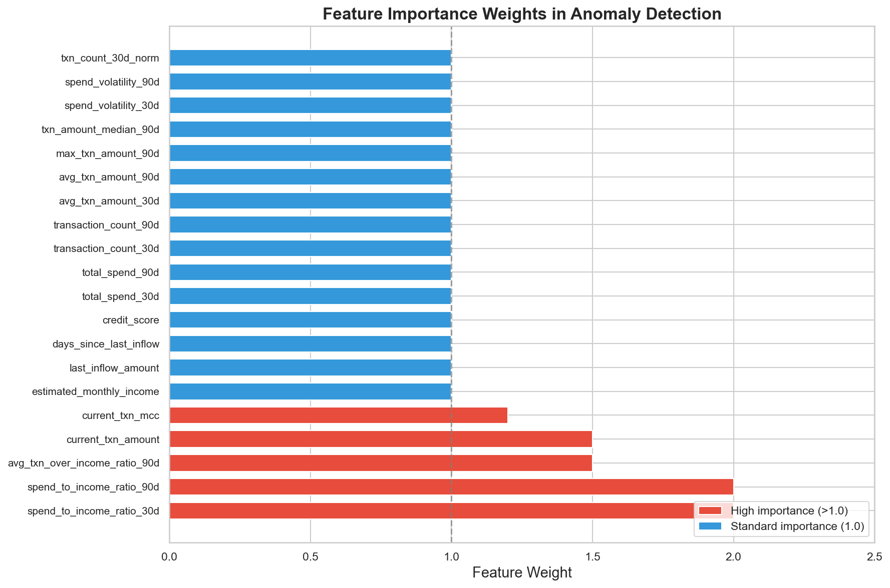

<p align="center">
  <h1 align="center">🏦 Morzio</h1>
  <p align="center">
    <strong>AI-Powered Buy Now, Pay Later Platform</strong>
  </p>
  <p align="center">
    Real-time risk assessment using Variational Autoencoders for instant credit decisions
  </p>
</p>

<p align="center">
  
  
  
  
  
</p>

---

## 📋 Table of Contents

- [Overview](#-overview)
- [System Architecture](#-system-architecture)
- [Payment Flow](#-payment-flow)
- [Machine Learning Model](#-machine-learning-model-deep-dive)
  - [Variational Autoencoder Architecture](#variational-autoencoder-vae-architecture)
  - [Loss Function & Training](#loss-function--training)
  - [Anomaly Detection](#anomaly-detection-mechanism)
- [Installment Formula](#-installment-formula-deep-dive)
  - [Mathematical Formulation](#mathematical-formulation)
  - [Affordability Factor](#1-affordability-factor-fρ)
  - [Anomaly Factor](#2-anomaly-factor-aερ)
  - [Decision Logic](#3-final-decision-logic)
- [Feature Engineering](#-feature-engineering)
- [API Reference](#-api-reference)
- [Tech Stack](#-tech-stack)
- [Getting Started](#-getting-started)
- [Testing](#-testing)

---

## 🎯 Overview

**Morzio** is a complete Buy Now, Pay Later (BNPL) fintech platform that enables merchants to offer installment payments (4-48 months) to customers. Unlike traditional credit scoring that relies on credit bureau checks, Morzio uses **machine learning** to analyze real-time transaction patterns and make instant credit decisions.

### Key Features

| Feature                | Description                                               |
| ---------------------- | --------------------------------------------------------- |
| **Instant Approval**   | Decisions in seconds, no credit bureau checks             |
| **AI Risk Assessment** | VAE-based anomaly detection on 90-day transaction history |
| **Flexible Terms**     | 4 to 48 installments based on risk profile                |
| **Bank Integration**   | Plaid API for secure Open Banking data                    |
| **Merchant POS**       | Android app with QR code payment flow                     |

### How It Works

```
Customer wants to buy £500 laptop
         │
         ▼
┌─────────────────────────────────────────────────────────┐
│  1. Merchant scans amount → QR code generated           │
│  2. Customer scans QR → connects bank via Plaid         │
│  3. ML analyzes 90 days of transactions                 │
│  4. AI calculates risk score + affordability            │
│  5. Decision: "Approved for 36 installments" ✓          │
└─────────────────────────────────────────────────────────┘
```

---

## 🏗 System Architecture

```
┌─────────────────────────────────────────────────────────────────────────────┐
│                              MORZIO ARCHITECTURE                             │
└─────────────────────────────────────────────────────────────────────────────┘

┌─────────────────┐         ┌─────────────────┐         ┌─────────────────┐
│                 │         │                 │         │                 │
│  📱 Android     │◀───────▶│  ☕ Spring Boot │◀───────▶│  🐍 FastAPI     │
│  Terminal       │  REST   │  Server         │  REST   │  ML Service     │
│  (Kotlin)       │         │  (Java 17)      │         │  (Python)       │
│                 │         │                 │         │                 │
└─────────────────┘         └────────┬────────┘         └─────────────────┘
                                     │
                                     │ HTTPS
                                     ▼
                            ┌─────────────────┐
                            │                 │
                            │  🏦 Plaid API   │
                            │  (Bank Data)    │
                            │                 │
                            └─────────────────┘
```

### Component Overview

| Component      | Technology                    | Purpose                                               |
| -------------- | ----------------------------- | ----------------------------------------------------- |
| **Terminal**   | Kotlin, Jetpack Compose       | Merchant POS app, QR generation                       |
| **Server**     | Java 17, Spring Boot 4.0      | Business logic, Plaid integration, session management |
| **ML Service** | Python 3.12, FastAPI, PyTorch | Risk assessment, anomaly detection                    |
| **Database**   | PostgreSQL                    | Payment sessions, installment plans                   |
| **Bank API**   | Plaid                         | Transaction history, account balances                 |

---

## 🔄 Payment Flow

### Step-by-Step Process

```
┌──────────────────────────────────────────────────────────────────────────────┐
│  STEP 1: MERCHANT INITIATES                                                  │
│  ─────────────────────────────                                               │
│  • Merchant enters £500 on POS terminal                                      │
│  • Server creates PaymentSession (status: PENDING)                           │
│  • Returns URL: morzio.com/pay/{sessionId}                                   │
│  • Terminal displays QR code                                                 │
└──────────────────────────────────────────────────────────────────────────────┘
                                     │
                                     ▼
┌──────────────────────────────────────────────────────────────────────────────┐
│  STEP 2: CUSTOMER CONNECTS BANK                                              │
│  ──────────────────────────────────                                          │
│  • Customer scans QR → opens payment page                                    │
│  • Clicks "Connect Bank" → Plaid Link opens                                  │
│  • Authenticates with their bank                                             │
│  • Plaid returns access token                                                │
└──────────────────────────────────────────────────────────────────────────────┘
                                     │
                                     ▼
┌──────────────────────────────────────────────────────────────────────────────┐
│  STEP 3: DATA RETRIEVAL                                                      │
│  ──────────────────────────                                                  │
│  • Server fetches 90 days of transactions via Plaid                          │
│  • Extracts: amounts, dates, categories, merchant info                       │
│  • Typically 50-500 transactions per user                                    │
└──────────────────────────────────────────────────────────────────────────────┘
                                     │
                                     ▼
┌──────────────────────────────────────────────────────────────────────────────┐
│  STEP 4: ML RISK ASSESSMENT                                                  │
│  ────────────────────────────                                                │
│  • Transactions → 20-feature vector                                          │
│  • VAE model calculates anomaly score                                        │
│  • Installment formula determines max payments                               │
│  • Returns: {approved: true, max_installments: 36}                           │
└──────────────────────────────────────────────────────────────────────────────┘
                                     │
                                     ▼
┌──────────────────────────────────────────────────────────────────────────────┐
│  STEP 5: CUSTOMER DECISION                                                   │
│  ──────────────────────────────                                              │
│  • Shows installment options: Pay in 4, 8, 12, 24, 36                        │
│  • Customer selects plan                                                     │
│  • Payment initiated, session marked COMPLETED                               │
└──────────────────────────────────────────────────────────────────────────────┘
```

---

## 🧠 Machine Learning Model Deep Dive

### Variational Autoencoder (VAE) Architecture

Our anomaly detection system uses a **Variational Autoencoder** trained on 44,615 legitimate transaction patterns. The model learns to reconstruct "normal" spending behavior—transactions that deviate significantly from this learned distribution are flagged as anomalous.



#### Why VAE for Anomaly Detection?

1. **Unsupervised Learning**: No need for labeled fraud data
2. **Probabilistic**: Captures uncertainty in predictions
3. **Generative**: Learns the underlying distribution of normal behavior
4. **Interpretable**: Reconstruction error directly measures "unusualness"

#### Network Architecture

```
INPUT LAYER          ENCODER              LATENT SPACE           DECODER              OUTPUT LAYER
    │                   │                      │                    │                     │
    │    ┌──────────┐   │   ┌──────────┐      │                    │   ┌──────────┐     │
    │    │ FC(20→64)│   │   │ FC(128)  │      │   ┌────────┐       │   │FC(256→128)│    │
[20]────▶│   SiLU   │──▶│──▶│    μ     │─────▶│──▶│  z     │──────▶│──▶│   SiLU   │───▶[20]
    │    └──────────┘   │   └──────────┘      │   │(256)   │       │   └──────────┘     │
    │    ┌──────────┐   │   ┌──────────┐      │   └────────┘       │   ┌──────────┐     │
    │    │FC(64→128)│   │   │ FC(128)  │      │        ▲           │   │FC(128→64)│     │
    │───▶│   SiLU   │──▶│──▶│  log σ²  │──────│────────┘           │──▶│   SiLU   │────▶│
    │    └──────────┘   │   └──────────┘      │   z = μ + σ·ε      │   └──────────┘     │
    │    ┌──────────┐   │                      │                    │   ┌──────────┐     │
    │    │FC(128→128)│  │                      │                    │   │ FC(64→20)│     │
    │───▶│          │──▶│                      │                    │──▶│          │────▶│
    │    └──────────┘   │                      │                    │   └──────────┘     │
```

**Hyperparameters:**

- Input/Output Dimension: 20 features
- Hidden Dimension: 64 → 128
- Latent Dimension: 256
- Activation: SiLU (Sigmoid Linear Unit)
- Dropout: 0.1

### Loss Function & Training

The VAE is trained to minimize the **Evidence Lower Bound (ELBO)**:

$$\mathcal{L}(\theta, \phi; x) = \underbrace{\mathbb{E}_{q_\phi(z|x)}[\log p_\theta(x|z)]}_{\text{Reconstruction Term}} - \underbrace{D_{KL}(q_\phi(z|x) \| p(z))}_{\text{KL Divergence}}$$

**In practice:**

$$\mathcal{L} = \text{MSE}(x, \hat{x}) + D_{KL}$$

Where:

- **Reconstruction Loss (MSE)**: Measures how well the model recreates the input
- **KL Divergence**: Regularizes the latent space to follow N(0, I)

**Reparameterization Trick:**

To enable backpropagation through stochastic sampling:

$$z = \mu + \sigma \odot \epsilon, \quad \epsilon \sim \mathcal{N}(0, I)$$

**Training Configuration:**
| Parameter | Value |
|-----------|-------|
| Dataset Size | 44,615 samples |
| Batch Size | 64 |
| Learning Rate | 3×10⁻⁴ |
| Optimizer | AdamW |
| Epochs | 100 (with early stopping) |
| Train/Val/Test Split | 80/10/10 |

### Anomaly Detection Mechanism

After training, we use the model to detect anomalies by measuring how "surprising" a transaction pattern is:

**Anomaly Score:**

$$S = \alpha \cdot \text{MSE}(x, \hat{x}) + \beta \cdot D_{KL}$$

Where α = 1.0, β = 0.05



**Risk Classification:**

| Normalized Score (ε) | Risk Level     | Interpretation            |
| -------------------- | -------------- | ------------------------- |
| ε < 0.3              | 🟢 Low Risk    | Normal spending patterns  |
| 0.3 ≤ ε < 0.6        | 🟡 Medium Risk | Some unusual activity     |
| ε ≥ 0.6              | 🔴 High Risk   | Significantly anomalous   |
| ε > 0.85             | ⛔ Block       | Potential fraud/high risk |

---

## 📐 Installment Formula Deep Dive

The installment calculation combines **affordability** (can they pay?) with **anomaly risk** (should we trust them?) using sigmoid-based smooth transitions.

### Mathematical Formulation

The maximum number of installments is calculated as:

$$\boxed{N^* = N_{max} \cdot f(\rho) \cdot a(\epsilon, \rho)}$$

Where:

- $N_{max} = 48$ (maximum possible installments)
- $f(\rho)$ = Affordability factor
- $a(\epsilon, \rho)$ = Anomaly factor
- Final $N$ = round to nearest multiple of 4

### 1. Affordability Factor f(ρ)

Measures whether the customer can afford the purchase relative to their income.

**Affordability Ratio:**

$$\rho = \frac{|A|}{I + 1}$$

Where:

- $A$ = Transaction amount (purchase price)
- $I$ = Estimated monthly income

**Affordability Factor:**

$$f(\rho) = 1 - \sigma(k_f \cdot (\rho - \rho_0))$$

Parameters:

- $\rho_0 = 0.45$ (threshold where factor drops to 0.5)
- $k_f = 5.0$ (steepness of sigmoid)



**Interpretation:**

- ρ < 0.3: Purchase is <30% of income → Full installments available
- ρ ≈ 0.45: Purchase is ~45% of income → Factor drops to 0.5
- ρ > 0.7: Purchase exceeds 70% of income → Very few installments

### 2. Anomaly Factor a(ε, ρ)

Penalizes users with suspicious spending patterns, with the penalty scaling based on affordability.

**Normalized Anomaly Score:**

$$\epsilon = \sigma(k \cdot (S - \tau))$$

Parameters:

- $\tau = 2.0$ (anomaly threshold)
- $k = 1.2$ (normalization steepness)

**Anomaly Weight:**

$$w(\rho) = \sigma(k_a \cdot (\rho - \rho_1))$$

Parameters:

- $\rho_1 = 0.5$
- $k_a = 5.0$

**Anomaly Factor:**

$$a(\epsilon, \rho) = 1 - w(\rho) \cdot \epsilon^2$$



**Key Insight:** The anomaly penalty increases with affordability ratio. A low-income user with anomalous patterns is penalized more heavily than a high-income user with the same patterns.

### 3. Final Decision Logic

**Combined Installment Surface:**





**Decline Rule:**

$$\text{If } \epsilon > 0.90 \text{ AND } \rho > 0.2 \Rightarrow N = 0 \text{ (DECLINED)}$$

**Rounding:**

$$N = 4 \cdot \text{round}\left(\frac{N^*}{4}\right)$$

Valid installment values: 0, 4, 8, 12, 16, 20, 24, 28, 32, 36, 40, 44, 48

### Example Calculations

| Scenario                    | Income | Purchase | ρ    | Anomaly | ε    | f(ρ) | a(ε,ρ) | N\*  | Final    |
| --------------------------- | ------ | -------- | ---- | ------- | ---- | ---- | ------ | ---- | -------- |
| Normal user, small purchase | £3000  | £200     | 0.07 | 1.5     | 0.35 | 0.99 | 0.98   | 46.5 | **44**   |
| Normal user, large purchase | £3000  | £1500    | 0.50 | 1.8     | 0.45 | 0.50 | 0.90   | 21.6 | **20**   |
| Risky user, medium purchase | £2000  | £500     | 0.25 | 8.0     | 0.92 | 0.85 | 0.58   | 23.7 | **24**   |
| Low income, expensive item  | £500   | £1500    | 3.0  | 2.5     | 0.65 | 0.00 | 0.58   | 0.0  | **0** ❌ |

---

## 🔧 Feature Engineering

The ML model uses 20 engineered features extracted from 90 days of transaction history:



### Complete Feature Table

| #   | Feature                         | Description                     | Weight  |
| --- | ------------------------------- | ------------------------------- | ------- |
| 1   | `estimated_monthly_income`      | Sum of income transactions ÷ 3  | 1.0     |
| 2   | `last_inflow_amount`            | Most recent income amount       | 1.0     |
| 3   | `days_since_last_inflow`        | Days since last income          | 1.0     |
| 4   | `credit_score`                  | Default value (715)             | 1.0     |
| 5   | `total_spend_30d`               | Total expenses in last 30 days  | 1.0     |
| 6   | `total_spend_90d`               | Total expenses in last 90 days  | 1.0     |
| 7   | `transaction_count_30d`         | Number of transactions (30d)    | 1.0     |
| 8   | `transaction_count_90d`         | Number of transactions (90d)    | 1.0     |
| 9   | `avg_txn_amount_30d`            | Average transaction (30d)       | 1.0     |
| 10  | `avg_txn_amount_90d`            | Average transaction (90d)       | 1.0     |
| 11  | `max_txn_amount_90d`            | Largest single transaction      | 1.0     |
| 12  | `txn_amount_median_90d`         | Median transaction amount       | 1.0     |
| 13  | `spend_volatility_30d`          | Std deviation of spending (30d) | 1.0     |
| 14  | `spend_volatility_90d`          | Std deviation of spending (90d) | 1.0     |
| 15  | `spend_to_income_ratio_30d`     | 30d spend ÷ monthly income      | **2.0** |
| 16  | `spend_to_income_ratio_90d`     | 90d spend ÷ 3× monthly income   | **2.0** |
| 17  | `avg_txn_over_income_ratio_90d` | Avg transaction ÷ income        | **1.5** |
| 18  | `txn_count_30d_norm`            | Transaction count ÷ 30          | 1.0     |
| 19  | `current_txn_amount`            | Current purchase amount         | **1.5** |
| 20  | `current_txn_mcc`               | Merchant Category Code          | **1.2** |

### Preprocessing

1. **Log Scaling**: Applied to monetary features (income, spend amounts)
2. **Z-Score Normalization**: (x - μ) / σ using training set statistics
3. **Feature Weighting**: High-importance features multiplied by weights
4. **Outlier Clipping**: Values clipped to 0.5-99.5 percentile

---

## 📡 API Reference

### ML Service (Port 8000)

#### Health Check

```http
GET /health
```

**Response:**

```json
{
  "status": "healthy",
  "model_loaded": true
}
```

#### Predict Installments

```http
POST /api/predict
Content-Type: application/json
```

**Request:**

```json
{
  "transactions": [
    { "amount": -3000.0, "date": "2025-11-01", "category": "INCOME" },
    { "amount": 45.5, "date": "2025-11-28", "category": "FOOD_AND_DRINK" }
  ],
  "transaction_amount": 250.0,
  "transaction_mcc": 5411
}
```

**Response:**

```json
{
  "approved": true,
  "max_installments": 40
}
```

### Server API (Port 8080)

#### Initiate Payment

```http
POST /api/payment/initiate
```

**Request:**

```json
{
  "amount": 25000
}
```

**Response:**

```json
{
  "sessionId": "550e8400-e29b-41d4-a716-446655440000",
  "status": "PENDING",
  "paymentUrl": "http://localhost:8080/pay/550e8400-e29b-41d4-a716-446655440000"
}
```

#### Plaid Success Callback

```http
POST /api/plaid/on-success
```

**Request:**

```json
{
  "publicToken": "public-sandbox-xxx",
  "transactionAmount": 250.0
}
```

---

## 🛠 Tech Stack

| Layer            | Technology              | Version     |
| ---------------- | ----------------------- | ----------- |
| **Mobile**       | Kotlin, Jetpack Compose | 1.9, 1.7    |
| **Backend**      | Java, Spring Boot       | 17, 4.0     |
| **ML Service**   | Python, FastAPI         | 3.12, 0.100 |
| **ML Framework** | PyTorch                 | 2.0         |
| **Database**     | PostgreSQL              | 15          |
| **Bank API**     | Plaid                   | -           |
| **Build Tools**  | Gradle, Maven           | 8.0, 3.9    |

---

## 🚀 Getting Started

### Prerequisites

- Java 17+
- Python 3.12+
- PostgreSQL
- Android Studio (for terminal app)
- Plaid API credentials

### 1. Clone Repository

```bash
git clone https://github.com/your-org/morzio.git
cd morzio
```

### 2. Start ML Service

```bash
cd ml
python -m venv venv
source venv/bin/activate
pip install -r api/requirements.txt
python -m api.main
```

Server runs at `http://localhost:8000`

### 3. Start Backend Server

```bash
cd server
# Configure application.properties with DB and Plaid credentials
./mvnw spring-boot:run
```

Server runs at `http://localhost:8080`

### 4. Run Android Terminal

1. Open `terminal/` in Android Studio
2. Sync Gradle dependencies
3. Run on device/emulator

---

## 🧪 Testing

### Run ML Pipeline Tests

```bash
cd ml
python test_full_pipeline.py
```

**Expected Output:**

```
TEST SUMMARY
═══════════════════════════════════════════════════════════════════════════════
Test Name                                     Result       Installments    Expected
───────────────────────────────────────────────────────────────────────────────
Normal User - Stable Income & Spending        APPROVED     40              36-48           PASS
Suspicious Activity - Erratic Spending        DECLINED     0               0-24            PASS
Too Expensive - Purchase > Income             DECLINED     0               0-0             PASS
───────────────────────────────────────────────────────────────────────────────
Total: 3/3 tests passed
```

### Test Scenarios

| Scenario            | Income | Purchase | Expected         |
| ------------------- | ------ | -------- | ---------------- |
| Normal user         | £3000  | £200     | ~40 installments |
| Suspicious patterns | £2000  | £500     | Declined         |
| Unaffordable        | £500   | £1500    | Declined         |

---

## 📄 License

Private - All rights reserved

---

<p align="center">
  <sub>Built with ❤️ for smarter lending decisions</sub>
</p>
